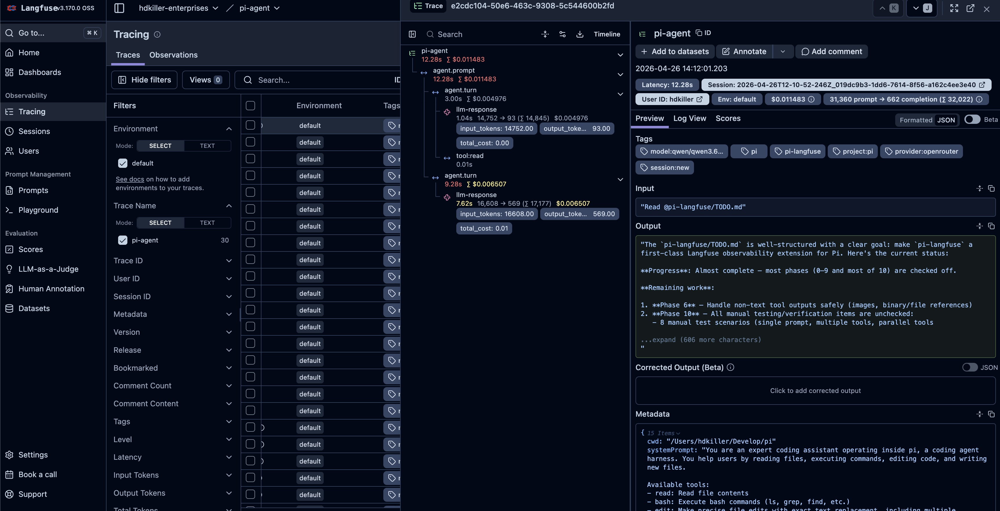

# pi-langfuse

Production-grade Langfuse observability for [Pi Coding Agent](https://github.com/mariozechner/pi-coding-agent).



## Why Langfuse?

Langfuse provides open-source observability for LLM applications. This extension traces Pi sessions locally or against any Langfuse-compatible endpoint so you can understand prompts, turns, tool calls, token usage, and failures.

## Features

- **Hierarchical Tracing**: Maps user prompts to per-turn spans and nested tool executions.
- **Streaming Generation**: Captures assistant responses as they stream.
- **LLM Metadata**: Records model, provider, token usage, and cost fields when pricing is configured.
- **Tool Observability**: Captures tool calls, sanitized arguments/results, and duration.
- **Session Correlation**: Groups prompts from the same Pi session into one Langfuse session.
- **Setup Wizard**: `/langfuse-init` configures either local self-hosted Langfuse or a remote/Langfuse Cloud endpoint.
- **Local-First Setup**: Local mode creates a self-hosted localhost Langfuse stack with generated secrets.
- **Autostart**: Once local init is complete, the extension starts Docker Compose on demand when tracing begins.

## Quick Start

Run the wizard inside Pi:

```text
/langfuse-init
```

Choose one of:

```text
Local self-hosted
Remote / Langfuse Cloud
```

Local mode creates a private Docker Compose stack. Remote mode writes only connection settings for Langfuse Cloud or an existing Langfuse instance.

## Local Quick Start

This is the recommended private setup. It does **not** require Langfuse Cloud.

### 1. Install the extension

```bash
pi install git:github.com/edxeth/pi-langfuse
```

For a local checkout, install dependencies and build first:

```bash
npm install
npm run build
```

Then enable the extension from your Pi settings/packages list.

### 2. Initialize local Langfuse

Inside Pi, run:

```text
/langfuse-init
```

The wizard asks for login details and confirmation before writing files. Defaults are:

```text
URL:      http://localhost:3100/auth/sign-in
Email:    local@example.test
Name:     Local User
Password: local-langfuse
```

Fast path for a local-only setup:

```text
/langfuse-init --yes
# equivalent:
/langfuse-init --yes --local
```

Useful options:

```text
/langfuse-init --yes --no-start
/langfuse-init --dir ~/.pi/agent/langfuse
/langfuse-init --host http://localhost:3100
/langfuse-init --email you@example.test --name "Your Name" --password local-langfuse
```

### 3. What gets created

By default, init writes into the active Pi agent directory:

```text
$PI_CODING_AGENT_DIR/langfuse
```

If `PI_CODING_AGENT_DIR` is unset, standalone Pi falls back to:

```text
~/.pi/agent/langfuse
```

Files created:

```text
docker-compose.yml
.env
pi-langfuse.json
```

Safety rule: `/langfuse-init` refuses to initialize into a non-empty directory. It does not overwrite an existing Langfuse stack.

### 4. Autostart behavior

After init, `pi-langfuse.json` enables tracing and local autostart. From then on:

- `pi` starts tracing on sessionful prompts.
- If local Langfuse is not healthy, the extension runs `docker compose up -d` in the local Langfuse directory.
- If Langfuse is already healthy, it only performs a fast health check.
- Unpersisted/no-session runs are skipped by default.

Disable autostart for one process:

```bash
PI_LANGFUSE_AUTOSTART=0 pi
```

## Langfuse Cloud or Existing Langfuse

Cloud is optional. If you already have a Langfuse Cloud account or another Langfuse instance, choose `Remote / Langfuse Cloud` in the wizard.

Fast path:

```text
/langfuse-init --yes --remote \
  --host https://cloud.langfuse.com \
  --public-key pk-lf-... \
  --secret-key sk-lf-...
```

For a custom self-hosted remote instance, change `--host`:

```text
/langfuse-init --yes --remote \
  --host https://langfuse.example.com \
  --public-key pk-lf-... \
  --secret-key sk-lf-...
```

Remote mode creates only:

```text
$PI_CODING_AGENT_DIR/langfuse/pi-langfuse.json
```

It does not create Docker Compose files and does not enable local Docker autostart.

You can also configure keys manually instead of using `/langfuse-init`.

Configuration precedence:

1. `/extensions:settings` if the optional settings extension is installed
2. `$PI_CODING_AGENT_DIR/langfuse/pi-langfuse.json`
3. `config.json` in this extension
4. `LANGFUSE_*` environment variables

Set:

```text
LANGFUSE_PUBLIC_KEY
LANGFUSE_SECRET_KEY
LANGFUSE_HOST
```

For self-hosted local mode, `LANGFUSE_HOST` is usually:

```text
http://localhost:3100
```

## Configuration

| Setting | Env Var | Default | Description |
| :--- | :--- | :--- | :--- |
| **Enabled** | - | `true` | Global toggle for tracing. |
| **Public Key** | `LANGFUSE_PUBLIC_KEY` | - | Langfuse project public key. |
| **Secret Key** | `LANGFUSE_SECRET_KEY` | - | Langfuse project secret key. |
| **Base URL** | `LANGFUSE_HOST` / `LANGFUSE_BASE_URL` | `https://cloud.langfuse.com` | API host. Use `http://localhost:3100` for local. |
| **User ID** | `PI_LANGFUSE_USER_ID` | `$USER` | Associate traces with a specific user. |
| **Environment** | `PI_LANGFUSE_ENV` | - | Tag traces, e.g. `local`, `staging`, `production`. |
| **Release** | `PI_LANGFUSE_RELEASE` | - | Tag traces with a version or release ID. |
| **Local Autostart** | `PI_LANGFUSE_AUTOSTART` | `config dependent` | `0` disables Docker autostart, `1` forces it. |
| **Local Autostart Dir** | `PI_LANGFUSE_AUTOSTART_DIR` | `$PI_CODING_AGENT_DIR/langfuse` | Directory containing `docker-compose.yml`. |
| **Capture Provider Payload** | `PI_LANGFUSE_CAPTURE_PROVIDER_PAYLOAD` | `false` | Optional raw provider payload metadata capture. |

## Usage

### Initialize Langfuse

```text
/langfuse-init
```

Non-interactive examples:

```text
/langfuse-init --yes --local
/langfuse-init --yes --remote --host https://cloud.langfuse.com --public-key pk-lf-... --secret-key sk-lf-...
```

### Toggle tracing

```text
/langfuse:toggle [on|off]
```

### Trace Model

```text
Trace (name: "pi-agent")
└── Span (name: "agent.prompt")
    └── Span (name: "agent.turn")
        ├── Generation (name: "llm-response")  <-- Cost/Token tracking
        └── Span (name: "tool:<name>")          <-- Arguments/Results
```

For a deep dive into the tracing model and data flow, see [docs/architecture.md](./docs/architecture.md).

## Privacy Notes

Local init is designed for private localhost use:

- Langfuse web/API binds to `127.0.0.1:3100`.
- Postgres, Redis, ClickHouse, and MinIO bind to localhost-only ports.
- Langfuse telemetry is disabled in the generated `.env` and Compose file.
- Langfuse Cloud is not used unless you explicitly configure a cloud host/key pair.

This does not change where your LLM provider sends prompts. If you use OpenAI, Anthropic, Google, or another remote model provider, Pi still sends prompts to that provider.

## Troubleshooting

- **No traces?** Check `http://localhost:3100/api/public/health`, API keys, and Pi console warnings.
- **Docker did not start?** Run `docker compose up -d` inside the local Langfuse directory.
- **Wrong login?** Check the generated `.env` for `LANGFUSE_INIT_USER_EMAIL` and `LANGFUSE_INIT_USER_PASSWORD`.
- **Incomplete traces?** Ensure your Pi version supports `message_*`, tool, and session lifecycle events.
- **Cost is zero?** Token usage can be captured even when model pricing is not configured.
- **Large payloads?** Adjust the max-char limits in config/settings.

## License

MIT
